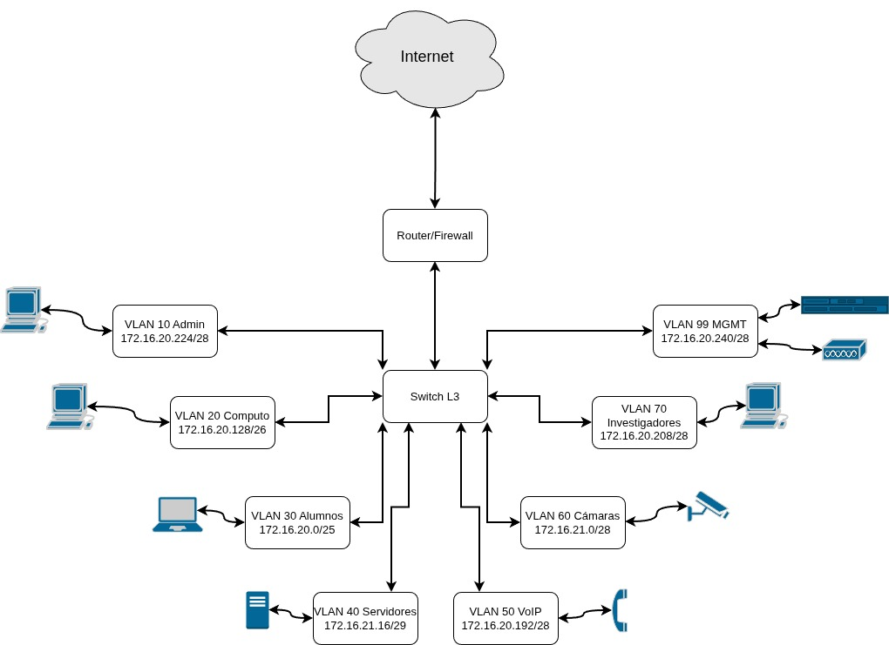
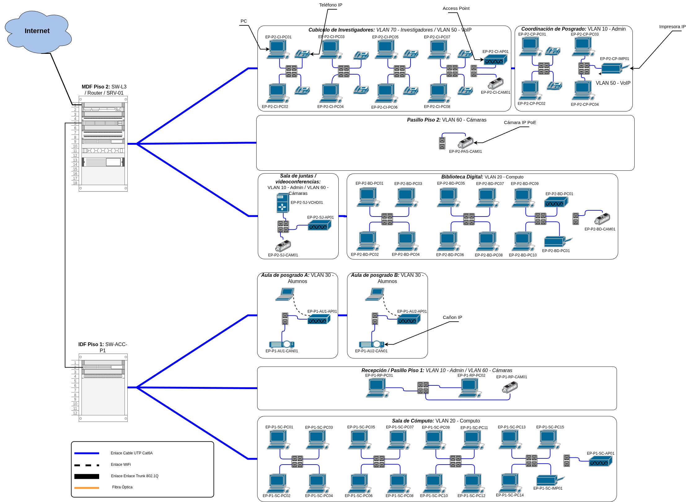
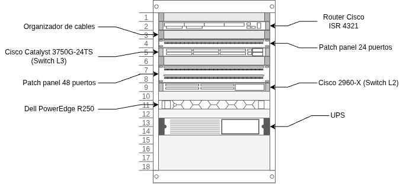

# Diseño de Red LAN — Edificio de Posgrado TecNM Pinotepa

Expediente técnico completo para la planificación e infraestructura de red del nuevo edificio de posgrado del Instituto Tecnológico de Pinotepa. Proyecto académico desarrollado para la materia de Redes de Computadoras.

## Descripción

Diseño documental de una red LAN de dos pisos con segmentación por VLANs, direccionamiento VLSM, enrutamiento inter-VLAN mediante switch de capa 3 y un SLA de disponibilidad del 99.99%. El proyecto cubre desde el levantamiento de requerimientos hasta el acta formal de entrega.

## Arquitectura

- **Topología:** Modelo jerárquico — núcleo L3, switches de acceso por piso
- **Segmentación:** 8 VLANs (Administrativos, Cómputo, Alumnos, Servidores, VoIP, Cámaras, Investigadores, Gestión)
- **Direccionamiento:** VLSM sobre bloque `172.16.20.0/22`
- **Enrutamiento inter-VLAN:** Switch Virtual Interface (SVI) en switch de capa 3
- **Disponibilidad (SLA):** 99.99% — equivalente a 52 minutos de caída al año

## Diagrama lógico

## Diagrama físico

## Diagrama de rack

## VLANs

| ID | Nombre | Propósito |
|----|--------|-----------|
| 10 | ADMIN | Personal administrativo y recepción |
| 20 | COMPUTO | Sala de cómputo y biblioteca digital |
| 30 | ALUMNOS | Dispositivos personales de estudiantes |
| 40 | SERVIDORES | Servidor DHCP, DNS y archivos |
| 50 | VOIP | Teléfonos IP |
| 60 | CAMARAS | Cámaras IP |
| 70 | INVESTIGADORES | Cubículos de investigadores |
| 99 | MGMT | Administración de switches y APs |

## Equipos propuestos

| Dispositivo | Modelo |
|-------------|--------|
| Switch L3 | Cisco Catalyst 3750G-24TS |
| Switches de acceso | Cisco 2960-X 48 puertos PoE+ |
| Router/Firewall | Cisco ISR 4321 |
| Access Points | Ubiquiti UniFi AP AC Pro |
| Servidor | Dell PowerEdge R250 |

## Documentación

Todos los documentos del expediente están disponibles en la carpeta [`docs/`](docs/):

| Código | Documento |
|--------|-----------|
| [F01](docs/F01_Memoria_Tecnica.pdf) | Memoria Técnica — análisis de necesidades y requerimientos |
| [F02](docs/F02_Diseno_Logico.pdf) | Diseño Lógico — VLANs, VLSM y diagrama lógico |
| [F03](docs/F03_Diseno_Fisico.pdf) | Diseño Físico — rack, cableado y diagrama físico |
| [F04](docs/F04_Plan_de_Pruebas.pdf) | Plan de Pruebas — 12 pruebas documentadas |
| [F05](docs/F05_Acta_Entrega_Recepcion.pdf) | Acta de Entrega-Recepción |

## Equipo

- Iván N. Guzmán Hernández — [github.com/NarcisoIn](https://github.com/NarcisoIn)
- Edgar E. Portillo López

**Institución:** TecNM Campus Pinotepa · Ingeniería en Sistemas Computacionales  
**Materia:** Redes de Computadoras · Mayo 2026
